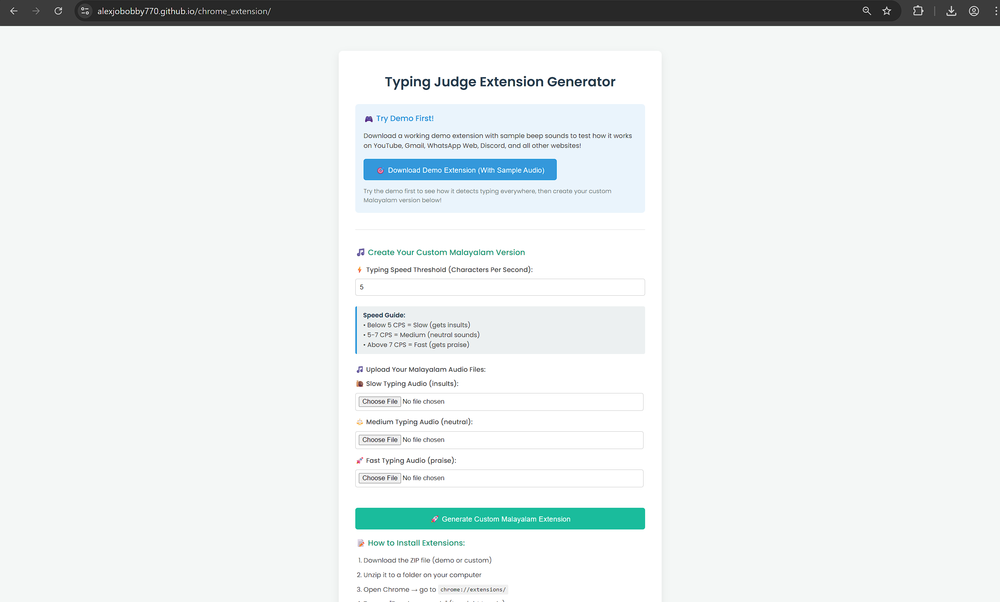
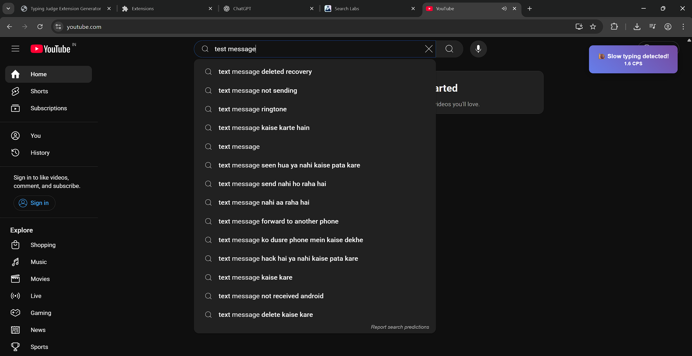
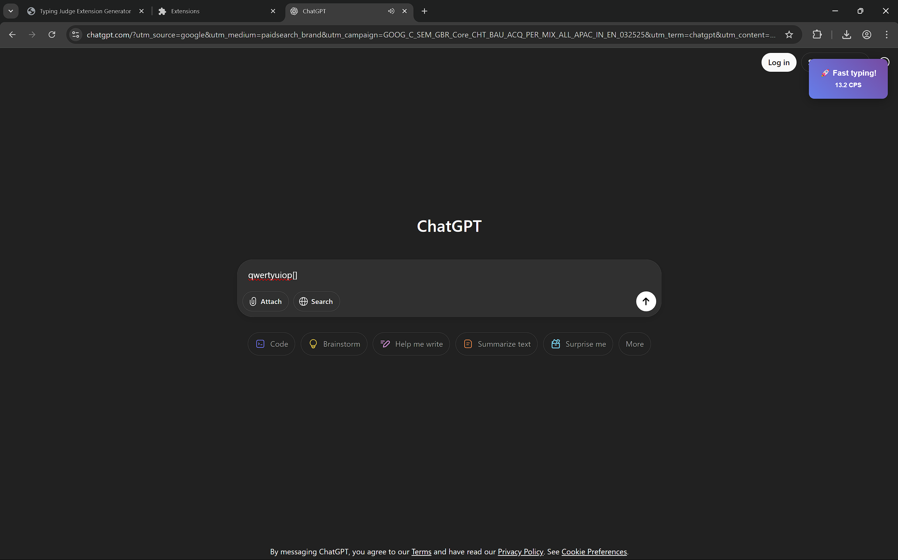

# Malayalam Typing Judge 🎯


## Basic Details
### Team Name: Type Chaos Creators

### Team Members
- Team Lead: [Your Name] - [Your College]
- Member 2: [Name] - [College]
- Member 3: [Name] - [College]

### Project Description
A Chrome extension generator that creates personalized typing speed judges with Malayalam audio commentary. Monitor your typing across ALL websites and get real-time feedback based on your speed - from encouraging praise to hilarious roasts!

### The Problem (that doesn't exist)
Ever felt like your typing was too peaceful? Missing that judgmental Malayalam uncle/aunty who comments on everything you do? Your keyboard was feeling too quiet and your typing sessions lacked proper cultural commentary! Plus, there was absolutely no way to get unsolicited opinions about your typing speed while browsing the internet.

### The Solution (that nobody asked for)
We created a Chrome extension generator that monitors your typing speed across ALL websites and plays custom Malayalam audio files to judge your performance:
- Type slow? Get roasted in Malayalam! 🐌
- Type at average speed? Get balanced feedback! ⚖️
- Type fast? Get praised in Malayalam! 🚀

Because apparently, we needed to add more pressure to our daily typing activities and make every keystroke a performance review!

## Technical Details
### Technologies/Components Used
For Software:
- **Languages:** JavaScript (ES6+), HTML5, CSS3
- **Libraries:** JSZip 3.10.1 for dynamic extension packaging
- **APIs:** Chrome Extension Manifest V3, Web Audio API, File API
- **Frameworks:** Vanilla JavaScript (because sometimes less is more)
- **Tools:** Chrome Developer Tools, Content Script Injection

### Implementation
For Software:

#### Installation & Setup
```bash
# Clone the repository
git clone [your-repo-url]

# Navigate to project directory
cd malayalam-typing-judge

# Open index.html in any modern browser
# No build process required - pure client-side magic!
```

#### How to Use the Generator
1. Open `index.html` in your browser
2. **Try the demo first**: Download the sample extension with beep sounds
3. **Create custom version**: 
   - Set your typing speed threshold (Characters Per Second)
   - Upload 3 Malayalam audio files:
     - Slow typing audio (for roasting)
     - Medium typing audio (neutral feedback)  
     - Fast typing audio (praise)
4. Click "Generate Custom Malayalam Extension"
5. Download the generated ZIP file

#### How to Install Generated Extensions
1. Unzip the downloaded file
2. Open Chrome → `chrome://extensions/`
3. Enable "Developer mode" (top right toggle)
4. Click "Load unpacked" → select your unzipped folder
5. Start typing anywhere and get judged! 🎭

### Project Documentation

#### Screenshots

*The web-based extension generator with demo and custom creation options*


*Real-time typing speed notification appearing while typing on YouTube*


*Extension working across Gmail, Discord, Twitter, and WhatsApp Web simultaneously*

#### Architecture Diagram
```
┌─────────────────────────────────────────────────────────────┐
│                    Web-Based Generator                      │
│  ┌─────────────┐  ┌─────────────┐  ┌─────────────────────┐ │
│  │ HTML/CSS UI │  │ File Upload │  │ Extension Generator │ │
│  │   Interface │──│   Handler   │──│      (JSZip)        │ │
│  └─────────────┘  └─────────────┘  └─────────────────────┘ │
└─────────────────────────────────────────────────────────────┘
                               │
                               ▼
┌─────────────────────────────────────────────────────────────┐
│                  Generated Chrome Extension                 │
│  ┌─────────────┐  ┌─────────────┐  ┌─────────────────────┐ │
│  │ Manifest.json│  │Content Script│  │  Audio Files Folder │ │
│  │(Permissions)│  │(Typing Monitor)│  │  (slow/med/fast)   │ │
│  └─────────────┘  └─────────────┘  └─────────────────────┘ │
└─────────────────────────────────────────────────────────────┘
                               │
                               ▼
┌─────────────────────────────────────────────────────────────┐
│                    Real-Time Monitoring                     │
│        Works on ALL websites simultaneously:               │
│    YouTube │ Gmail │ Discord │ Twitter │ WhatsApp Web      │
└─────────────────────────────────────────────────────────────┘
```

### Key Features & Technical Highlights

#### Universal Website Compatibility
- **Smart Input Detection**: Recognizes text areas, content-editable divs, and input fields
- **Platform-Specific Handlers**: Special detection for YouTube, Gmail, Discord, Twitter, etc.
- **Dynamic Element Recognition**: Works with dynamically loaded content (SPAs)

#### Intelligent Typing Analysis
- **Real-Time Speed Calculation**: Characters Per Second (CPS) with sub-second precision
- **Adaptive Thresholds**: User-configurable speed benchmarks
- **Smart Filtering**: Only counts meaningful keystrokes (excludes navigation keys)
- **Session Management**: Auto-resets after inactivity periods

#### Audio System
- **Multi-Format Support**: MP3, WAV, OGG file compatibility
- **Cooldown Prevention**: 8-second intervals to prevent audio spam
- **Fallback Handling**: Graceful degradation when audio fails
- **Volume Control**: Optimized audio levels for user experience

#### Performance Optimizations
- **Event Debouncing**: Efficient keystroke handling without lag
- **Memory Management**: Automatic cleanup of audio objects and notifications
- **Cross-Site Compatibility**: Works with CSP restrictions and CORS policies
- **Lightweight Footprint**: Minimal resource usage across all websites

### Supported Platforms & Testing

#### Verified Website Compatibility
- ✅ **YouTube**: Comments, live chat, video descriptions
- ✅ **Gmail**: Compose emails, replies, drafts
- ✅ **WhatsApp Web**: Message composition, group chats
- ✅ **Discord**: Text channels, DMs, server messages
- ✅ **Twitter/X**: Tweet composition, replies, DMs
- ✅ **Facebook**: Posts, comments, messages
- ✅ **Instagram**: Comments, DMs, captions
- ✅ **Reddit**: Posts, comments, messages
- ✅ **LinkedIn**: Posts, messages, comments
- ✅ **Slack**: Channel messages, DMs, threads

#### Technical Implementation Details
- **Content Script Injection**: Monitors all page interactions
- **Event Capturing**: Uses `keydown` events with `true` capture flag
- **Element Analysis**: Multi-layer detection for various input types
- **Cross-Frame Support**: Works with iframes and embedded content

### Project Demo
#### Video Demo Features
[Add your demo video link here - showing the complete workflow]
*Demonstrates:*
- Extension generator interface walkthrough
- Demo extension creation and installation
- Custom Malayalam extension creation
- Real-time typing detection across multiple websites
- Audio feedback system in action
- Performance across different typing speeds

#### Live Demo Scenarios
1. **Slow Typing Demo**: Show typing at 1 CPS → Malayalam roasting audio plays
2. **Fast Typing Demo**: Show typing at 5+ CPS → Malayalam praise audio plays
3. **Multi-Website Demo**: Rapid switching between platforms showing universal detection
4. **Custom Audio Demo**: Upload process and custom audio file integration

## Team Contributions
- **[Name 1]**: Frontend development, UI/UX design, Chrome extension architecture, audio integration system
- **[Name 2]**: Typing detection algorithms, cross-website compatibility, performance optimization, testing framework
- **[Name 3]**: ZIP generation system, file handling, error management, documentation, deployment optimization

## Why This Project is Perfectly Useless Yet Brilliant

### The "Useless" Aspects
1. **Nobody Asked for Typing Judgment**: Yet here we are, adding performance anxiety to every keystroke
2. **Malayalam Audio Commentary**: Because your typing definitely needed cultural context and family-style criticism
3. **Works on ALL Websites**: Even your private messages get judged now - nowhere is safe!
4. **Customizable Roasting Levels**: Fine-tune exactly how much you want to be criticized while browsing
5. **No Practical Benefit**: Except making typing unnecessarily dramatic and stressful

### The Technical Brilliance
1. **Universal Compatibility**: Actually works across all major websites without breaking
2. **Real-Time Processing**: Genuinely impressive keystroke analysis and speed calculation
3. **Dynamic Extension Generation**: Complete Chrome extension created in browser with custom audio
4. **Smart Detection**: Sophisticated input field recognition across diverse web platforms
5. **Performance Optimized**: Runs efficiently without impacting browsing experience

### Cultural Impact
- Brings Malayalam commentary to the global internet
- Gamifies typing in the most unnecessary way possible
- Creates typing anxiety where none existed before
- Adds family-style judgment to solo activities
- Makes every text input a performance evaluation

## Future Useless Enhancements
- **Multi-Language Support**: Expand to Tamil, Telugu, Hindi roasting
- **AI-Powered Personalized Roasting**: Learn your weaknesses for targeted criticism
- **Social Features**: Share your typing shame with friends and family
- **Smart Speaker Integration**: Announce typing failures to entire household
- **Typing Style Analysis**: Judge not just speed but typing rhythm and patterns
- **Leaderboards**: Compare typing shame globally
- **Parent Mode**: Send typing reports to family WhatsApp groups

## Installation Troubleshooting

### Common Issues
1. **Audio Not Playing**: Check file formats (MP3/WAV work best)
2. **Extension Not Loading**: Ensure Developer Mode is enabled
3. **No Typing Detection**: Refresh page after installing extension
4. **Too Frequent Audio**: Extension has built-in 8-second cooldown

### Browser Compatibility
- ✅ **Chrome**: Full support (recommended)
- ✅ **Edge**: Full support with Chromium base
- ⚠️ **Firefox**: Requires manifest conversion
- ❌ **Safari**: Not supported (different extension system)

---
Made with ❤️ and unnecessary complexity at TinkerHub Useless Projects 


## License
MIT License - Feel free to judge typing speeds responsibly

## Disclaimer
This extension may cause:
- ✋ Increased typing anxiety and performance pressure
- 🎭 Unnecessary drama during casual browsing sessions
- 🤔 Friends asking "What's that Malayalam voice coming from your computer?"
- ⚡ Improved typing speed (unintended positive side effect)
- 👨‍👩‍👧‍👦 Family members wanting their own custom roasting extensions
- 🌍 Spreading Malayalam commentary across the global internet

**Use at your own risk of becoming a more judged (and possibly faster) typist!** 🎯

### Technical Disclaimers
- Extension monitors all typing activity for speed calculation
- Audio files are stored locally within the extension
- No data is transmitted to external servers
- Extension permissions are minimal (content script only)
- Compatible with Chrome's latest security policies

